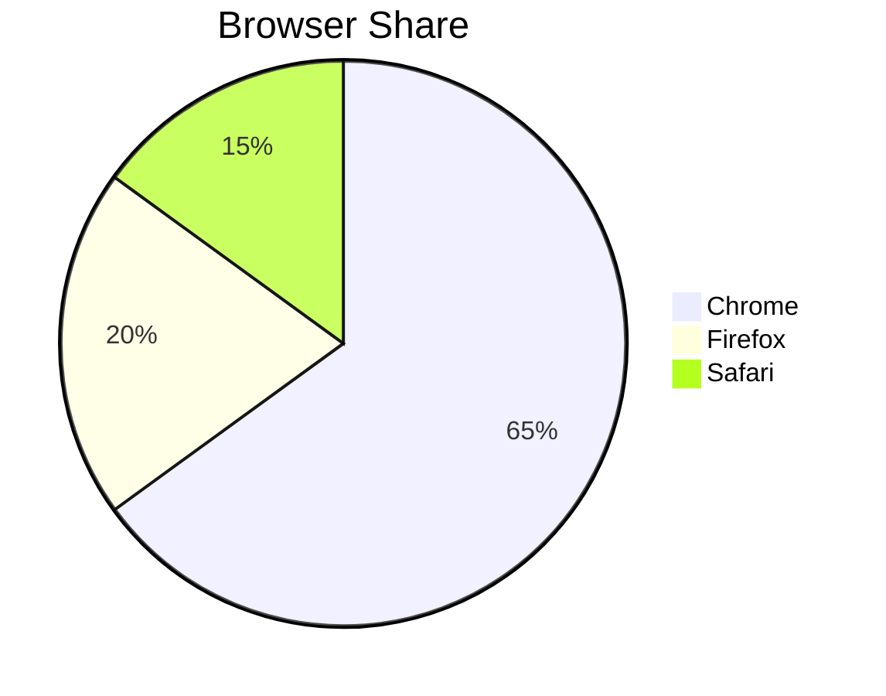
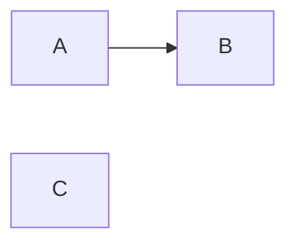

# Mermaid Validator

Validate Mermaid diagrams in two phases: (1) hard syntax validation via the `validate_mermaid` MCP tool, (2) semantic coherence reasoning. Always run Phase 1 first — syntax errors take precedence. Do not rewrite the diagram unless the user asks; report and annotate only.

## Step 1 — Locate Diagrams

Check the user's message:

- **File mode:** The user referenced a file path. Use `read_file` to load the file. Find every fenced code block with the `` ```mermaid `` language tag. Extract the raw content of each block (without the opening `` ```mermaid `` and closing ` ``` ` lines).
- **Inline mode:** The user pasted Mermaid text directly. If it is wrapped in `` ```mermaid `` fences, strip the fences. Use the raw diagram text.

If more than one diagram is found, validate each independently and label them by their position (Diagram 1, Diagram 2, …) or by the nearest preceding heading.

## Step 2 — Phase 1: Syntax Validation (MCP Tool)

For each diagram, call the `validate_mermaid` tool with the raw diagram string:

```
tool: validate_mermaid
input: { "diagram": "<raw diagram text>" }
```

Interpret the tool's JSON response:

- **`{ "valid": true, "diagramType": "..." }`** — Syntax is correct. Proceed to Phase 2.
- **`{ "valid": false, "diagramType": "...", "errors": [{"message": "..."}] }`** — Syntax errors found. Record each as a finding with `severity: error` and `source: Mermaid parser`. Still proceed to Phase 2 (semantic issues may explain the syntax error).
- **`{ "valid": null, "unsupported": true, "diagramType": "...", "message": "..." }`** — This diagram type is not supported by the static parser (e.g. `flowchart`, `sequenceDiagram`, `classDiagram`). Record a note in the output that syntax was not deterministically validated. Still proceed to Phase 2.
- **`isError: true`** — The tool itself failed. Record as an `error`-severity finding with the message. Skip Phase 2 for this diagram.

## Step 3 — Phase 2: Semantic Coherence Checks

Apply these reasoning-based checks to each diagram. These checks apply regardless of Phase 1 result (unless the tool returned `isError: true`).

**S-1 — Diagram type matches content** (severity: `warning`)
A `sequenceDiagram` should depict sequential message exchanges. A `classDiagram` should show class relationships. A `flowchart` should show process flow or decision logic. If the diagram type and its actual content appear mismatched (e.g. a `flowchart` that models class inheritance), flag it.

**S-2 — Labels are meaningful** (severity: `suggestion`)
Node and edge labels should describe real concepts, not placeholders like `A`, `B`, `Node1`, `TODO`. If most labels are single letters or generic identifiers, flag as a suggestion to add descriptive names.

**S-3 — Diagram direction is appropriate** (severity: `suggestion`)
For flowcharts and graphs: `LR` (left-right) suits pipeline/process flows; `TD` (top-down) suits hierarchies and trees. Flag if the direction appears mismatched for the content structure.

**S-4 — All referenced nodes are defined** (severity: `error`)
If an edge references a node identifier that is never explicitly defined as a node in the diagram, flag it. Example: `A --> C` where `C` never appears as a standalone node definition.
- Note: this may overlap with parser errors for supported diagram types. If the parser already caught it, do not duplicate the finding — add a note instead.

**S-5 — Diagram title or surrounding context matches content** (severity: `warning`)
If the diagram has a `title` directive, or if the surrounding prose describes what the diagram shows, check that the diagram's actual structure matches that description. Flag if the title says "Authentication Flow" but the diagram shows database tables.

**S-6 — No orphan nodes** (severity: `warning`)
Every node should participate in at least one edge. A node defined but not connected to anything is likely a copy/paste leftover or an incomplete diagram. Flag each orphan node by name.

## Step 4 — Compile Findings

Collect all findings from both phases into a single table per diagram. Use this format:

```
| Severity   | Phase   | Source          | Location                  | Description                                    | Recommended Fix                                      |
|------------|---------|-----------------|---------------------------|------------------------------------------------|------------------------------------------------------|
| error      | Syntax  | Mermaid parser  | Line 3                    | Unexpected token ">"                           | Check edge syntax: use --> not ->  for flowcharts    |
| warning    | Semantic| Reasoning       | Whole diagram             | Diagram type 'flowchart' used for class model  | Consider using classDiagram instead                  |
| suggestion | Semantic| Reasoning       | Nodes A, B, C             | Labels are single letters with no description  | Replace A/B/C with meaningful names                  |
```

If no findings exist for a diagram, state: `✓ Diagram N passed both syntax and semantic checks.`

## Step 5 — Confidence Score

Assign a confidence score (0–100) reflecting certainty in the validation:

- **90–100:** Diagram type is supported by the static parser AND passed; semantic checks are unambiguous.
- **70–89:** Diagram type is supported by the parser but semantic checks involved some inference; OR the type is unsupported but the diagram is small and clear.
- **50–69:** Diagram type is unsupported by the parser (syntax not deterministically validated) and the diagram is complex or the context is ambiguous.
- **Below 50:** Multiple unsupported diagram types, very large diagram, or highly ambiguous context.

## Step 6 — Output

Emit findings in this order for each diagram:

1. **Diagram N — `<diagramType>`** (or the nearest heading if available)
2. The findings table (Step 4). Omit the table if zero findings.
3. A blank line, then: `Confidence: <score>/100`
4. A one-line verdict:
   - Zero errors: `✓ No blocking issues found.` (note any warnings/suggestions)
   - One or more syntax errors: `✗ Diagram has syntax errors that will prevent rendering.`
   - No syntax errors but semantic warnings: `⚠ Diagram renders but may not accurately represent the intended content.`

---

## Usage Examples

### Example 1 — Valid diagram (supported type)

**Input:**
````

````

**Tool call:**
```json
{ "diagram": "pie title Browser Share\n  \"Chrome\" : 65\n  \"Firefox\" : 20\n  \"Safari\" : 15" }
```

**Tool response:**
```json
{ "valid": true, "diagramType": "pie" }
```

**Expected output:**
```
Diagram 1 — pie

✓ Diagram passed syntax check (Mermaid parser).

No semantic issues found.

Confidence: 95/100
✓ No blocking issues found.
```

---

### Example 2 — Syntax error (supported type)

**Input:**
````

````

**Tool response:**
```json
{
  "valid": false,
  "diagramType": "pie",
  "errors": [{ "message": "Parsing failed: Lexer error on line 2..." }]
}
```

**Expected output:**
```
Diagram 1 — pie

| Severity | Phase  | Source         | Location | Description                         | Recommended Fix                   |
|----------|--------|----------------|----------|-------------------------------------|-----------------------------------|
| error    | Syntax | Mermaid parser | Line 2   | Parsing failed: unexpected character at value | Replace "notanumber" with a numeric value e.g. 42 |

Confidence: 90/100
✗ Diagram has syntax errors that will prevent rendering.
```

---

### Example 3 — Unsupported type with semantic issue

**Input:**
````

````

**Tool response:**
```json
{
  "valid": null,
  "unsupported": true,
  "diagramType": "flowchart",
  "message": "Diagram type \"flowchart\" is not supported by the static parser..."
}
```

**Expected output:**
```
Diagram 1 — flowchart

Note: flowchart syntax was not validated by the static parser. Applying reasoning-based checks only.

| Severity | Phase    | Source    | Location | Description                    | Recommended Fix              |
|----------|----------|-----------|----------|--------------------------------|------------------------------|
| warning  | Semantic | Reasoning | Node C   | Node C is defined but not connected to any edge (orphan node) | Connect C to another node or remove it |

Confidence: 68/100
⚠ Diagram renders but may not accurately represent the intended content.
```
