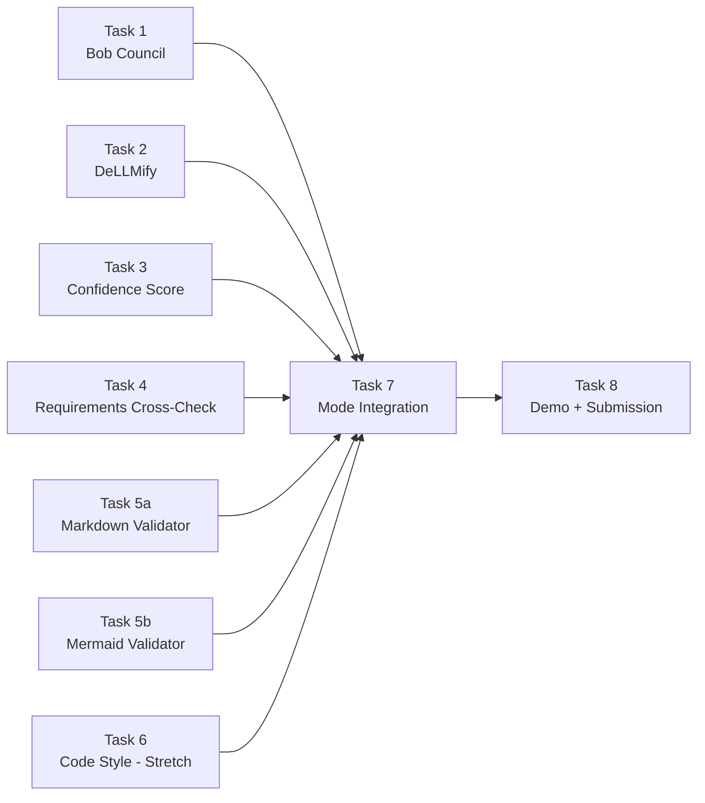
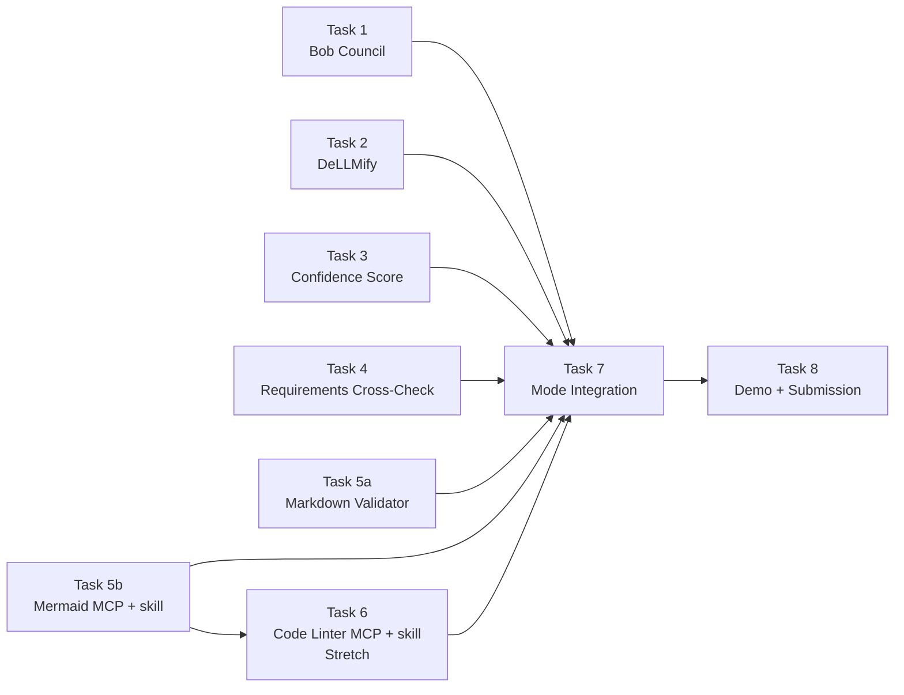

**User:** We are participating in a hackathon and want to create a new Bob mode focused on validation.

We have put together an initial docs/IDEAS.md file with some of our initial thoughts.

Our team is composed of six seperate developers that will need to work on subtasks in parallel

I would like help planing out and expanding on our ideas with a goal of breaking the plan into subtasks that the six devs can work on in parallel

We have already created an intial custom bob mode as a starting point, but do not treat it as a source of trth, just a first pass

---

**Bob:** Calling tools

---

---

**Bob:** Now let me read the IDEAS.md and explore the existing mode to ground the plan in what's already there.

---

---

---

---

---

**Bob:** Now let me read the chat histories and scripts for additional context:

---

---

---

---

**Bob:** I have a thorough picture of everything. Let me also check the README to round out the context:

---

---

**Bob:** Now I have a complete picture. Let me ask a few targeted clarifying questions before writing the plan, since the skill calls for scoping the work carefully.

---

**Bob:** The IDEAS.md lists several validation mechanisms. Which ones are must-haves for the hackathon demo versus nice-to-haves? This will drive how we prioritize and split the six subtasks.

---

---

**User:** I'm not sure any of those is completly correct, the list of ideas is not comprehensive, we are open to suggestions from you on more validations we could include.As for what we have, the Bob concuil is a must have, but the other ideas are not just in support of it but seperate stand alone ideas.No one validation is a must have, just a minimum numeber of them

---

**Bob:** Good. A couple more targeted questions before I write the plan:

---

**Bob:** What counts as "done" for the hackathon submission — is this a working Bob mode that judges can actually install and use, or primarily a demo/video of the concept?

---

---

**Bob:** For the Bob Council feature — what's your mental model of how it works? This determines how much infrastructure it needs.

---

---

**User:** I'm not quite sure any of those a exactly what we want. The first idea with the subagents sounds like the best idea, but rather than habving those subagents focus on lens they should use the personas as described in option 2

---

**Bob:** Got it — orchestrator spawns N subagents, each playing a named persona (The Critic, The Optimist, The Security Auditor, etc.), each reviews the artifact independently, then the orchestrator synthesizes. One more question to nail down scope before I write the plan:

---

**Bob:** How many and which validator skills/features should we target across the six developers? Bob Council is one task. We need to fill five more slots — which of these do you want to include?

---

---

**Bob:** That's four features plus Bob Council = five tasks. One slot remains. Let me suggest the strongest candidate:

---

**Bob:** That's five tasks so far (Bob Council + DeLLMify + Confidence Score + Markdown + Mermaid). What should the sixth developer work on?

---

---

**User:** I would argue that markdown and mermaid validation could be handled by one person (but seperate tracking tasks).As for the ideas you shared:- requirements check sounds like a good idea lets add it, in fact it could be the most central to the product value. Also the governing document validator idea you pitched feels like it would be a part of this rather than a seperate task- the demo and the mode tasks would most likely be better handled at the end by the team as a whole rather than a user specific task, but could still be seperate tracking tasks- another idea we could add is general code style validation and make that task a stretch goal

---

**Bob:** That's very clear. Let me confirm the full task breakdown before writing the plan:

**6 developers, but more than 6 tracking tasks — parallel heavy-lifters + end-game team tasks:**

| # | Task | Owner | Notes |
|---|---|---|---|
| 1 | **Bob Council** | Dev 1 | Orchestrator + named personas as subagents, synthesized report |
| 2 | **DeLLMify** | Dev 2 | Detect/strip LLM hedging and filler from any output |
| 3 | **Confidence Score** | Dev 3 | Structured confidence rating + uncertainty surfacing |
| 4 | **Requirements Cross-check** | Dev 4 | Validate artifact against source requirements doc; governing docs are a sub-case |
| 5 | **Markdown + Mermaid Validation** | Dev 5 | Two skills, one owner, separate tracking tasks |
| 6 | **Code Style Validation** | Dev 6 | ⚠️ Stretch goal — static only, no execution |
| 7 | **Mode + Orchestration Layer** | Full team | Wire all skills together, routing logic, `custom_modes.yaml` |
| 8 | **Demo + Submission Packaging** | Full team | Video, problem statement, README, zip |

---

**Bob:** Does this task breakdown look right before I write the plan file?

---

---

---

**Bob:** The plan is written at [`docs/PLAN.md`](docs/PLAN.md). Here's a summary of what it contains:

---

## Plan Summary

**8 tracking tasks across 6 developers**, structured as parallel skill work → integration → submission:

| Task | Feature | Owner | Notes |
|---|---|---|---|
| 1 | Bob Council | Dev 1 | Orchestrator + named personas as subagents |
| 2 | DeLLMify | Dev 2 | Pattern detection + cleaned output |
| 3 | Confidence Score | Dev 3 | Uncertainty dimensions + 0-100 score |
| 4 | Requirements Cross-check | Dev 4 | Coverage matrix; governing docs are a sub-case |
| 5a | Markdown Validator | Dev 5 | Structural rules, same dev as 5b |
| 5b | Mermaid Validator | Dev 5 | Syntax + semantic coherence |
| 6 | Code Style Validator | Dev 6 | ⚠️ Stretch goal — static only |
| 7 | Mode + Orchestration | Full team | Wire all skills, update mode YAML |
| 8 | Demo + Submission | Full team | Video, problem statement, zip |

**Key design decisions baked into the plan:**
- Every skill gets its own `skills/<name>/SKILL.md` so they're independently installable
- All skills share a common findings format (severity / location / description / fix + confidence score + verdict) — enforced at integration time in Task 7
- Requirements Cross-Check is positioned as the highest product-value feature and leads the demo
- Bob Council is the most visually impressive — leads the video
- Code Style is explicitly a stretch goal with a skip-if-short-on-time note

**Two questions to verify the plan is complete:**
1. Does the Bob Council persona list (Critic, Optimist, Security Auditor, Pedant, Requirements Reviewer) feel right, or do you want different/fewer personas?
2. Should any of the skills also produce a skill-specific `whenToUse` trigger phrase (for auto-routing from within the mode), or is that entirely handled in Task 7?

---

**User:** You chose to use skills for each task, why skills and not mcp tools? Or did you mean to write and use tools to support those skill or were mcp tools not on your radar when planning?

---

**Bob:** Good challenge. Let me think through this carefully before answering — I want to look at what Bob skills vs MCP tools actually enable here.

---

---

---

**Bob:** Here's the honest answer:

---

## Skills vs MCP Tools — the deliberate choice and where it falls short

**Skills are prompt documents, not executable code.** A `SKILL.md` is loaded into Bob's context as instructions. Bob reads them and reasons — it doesn't call an external binary or API. That's why they were the natural choice for most of the validation features here, which are fundamentally *reasoning tasks*:

| Feature | Why a skill is fine |
|---|---|
| DeLLMify | Pattern matching over text — pure reasoning |
| Confidence Score | Bob assessing its own uncertainty — pure reasoning |
| Requirements Cross-check | Comparing two documents — pure reasoning |
| Bob Council | Orchestrating subagents — reasoning + `spawn_subagent` |
| Markdown Validator | Checking structural rules — Bob can do this statically |

**But I did leave something on the table.** MCP tools become the right answer the moment you want *deterministic, external validation* rather than LLM reasoning. The clearest cases:

| Feature | What a skill gives you | What an MCP tool could give you |
|---|---|---|
| Mermaid Validator | Bob *reasons* about whether the syntax looks right | Actually run the Mermaid parser — deterministic pass/fail |
| Code Style Validator | Bob *guesses* at style issues | Actually run ESLint / Pylint — real linter output |
| Markdown Validator | Bob *reasons* about structure | Actually run `markdownlint` — deterministic rule violations |

The `mcp` permission group is already in the mode's `groups`, so we have the door open — I just didn't walk through it.

**My recommendation for the plan:** Two of the six tasks have a natural MCP tool upgrade path worth calling out explicitly:

- **Task 5b (Mermaid)** — a small MCP server that shells out to the Mermaid CLI would make this deterministic instead of probabilistic. Meaningful for a hackathon demo.
- **Task 6 (Code Style — stretch goal)** — this is arguably *only* worth building as an MCP tool that invokes a real linter. A skill that "reasons about code style" is weak. If we build it, it should call ESLint/Pylint via MCP.

Should I update the plan to add an optional MCP server sub-task for Mermaid, and upgrade the Code Style stretch goal to explicitly be an MCP tool rather than a skill?

---

**User:** yes please

---

**Bob:** Calling tools

---

---

---

**Bob:** [`docs/PLAN.md`](docs/PLAN.md) is updated. Here's a summary of what changed and why:

---

## What changed

**Overview section** now explicitly documents the skills-vs-MCP-tools decision as a first-class architectural choice, so every developer understands the boundary before they start:
- Skills → reasoning-based validation (DeLLMify, Confidence Score, Requirements Cross-Check, Bob Council, Markdown)
- MCP tools → deterministic external validation (Mermaid parser, ESLint, Pylint)

**Task 5b (Mermaid)** is now two-layer:
1. A `validate_mermaid` MCP tool that runs the actual Mermaid CLI parser — deterministic pass/fail
2. A thin skill on top that calls the tool for syntax, then adds semantic coherence reasoning (the part that still needs LLM judgment)

**Task 6 (Code Style — stretch)** is now genuinely useful instead of weak:
- Drops the "Bob reasons about style" approach entirely
- Instead extends the same MCP server from Task 5b with `lint_javascript` (ESLint) and `lint_python` (Pylint/Ruff)
- Has an explicit dependency noted: Task 6 dev coordinates with Task 5b dev on the MCP server scaffold

**Dependency diagram** updated to reflect the new Task 5b → Task 6 dependency on the shared MCP server.

---

The updated dependency picture:

Ready to switch to Agent mode and start implementing when you are.

---

**User:** Two follow up items:1. In addition to this planning doc I would like to open GitHub Issues on the repo for each sub task2. We should create a seperate GitHub issue for the creataion of the mcp server so as to  have a single upstream task for the subtasks that need it

---

**Bob:** Let me get the repo details first before creating anything.

---

---

**Bob:** Good — `ajbozarth/bob-validation-mode` on github.com. I'll create all 10 issues in parallel: 8 task issues + 1 MCP server scaffold issue + 1 tracking issue that ties them all together.

---

---

---

---

---

---

---

---

---

---

---

**Bob:** The GitHub MCP tool is hitting a 401 — it doesn't have credentials for `ajbozarth/bob-validation-mode`. This is a write operation to a personal repo, so the MCP server's token either isn't set or doesn't have access to it.

A couple of options to unblock this:

---

**Bob:** The GitHub MCP tool is getting a 401 — it doesn't have write credentials for ajbozarth/bob-validation-mode. How would you like to proceed?

---

---

---

---

**Bob:** `gh` is authenticated as `ajbozarth`. Creating all 10 issues now in one batch:

---

---

---

**Bob:** Let me use temporary files for the issue bodies to avoid shell quoting issues:

---

---

---

**Bob:** All 10 issues created. Now the tracking umbrella issue:

---

---

**Bob:** All done. Here's the full issue map:

| Issue | Task | Notes |
|---|---|---|
| [#4](https://github.com/ajbozarth/bob-validation-mode/issues/4) | Task 0 — MCP Server Scaffold | Blocks #10 and #11 |
| [#5](https://github.com/ajbozarth/bob-validation-mode/issues/5) | Task 1 — Bob Council | Parallel |
| [#6](https://github.com/ajbozarth/bob-validation-mode/issues/6) | Task 2 — DeLLMify | Parallel |
| [#7](https://github.com/ajbozarth/bob-validation-mode/issues/7) | Task 3 — Confidence Score | Parallel |
| [#8](https://github.com/ajbozarth/bob-validation-mode/issues/8) | Task 4 — Requirements Cross-Check | Parallel |
| [#9](https://github.com/ajbozarth/bob-validation-mode/issues/9) | Task 5a — Markdown Validator | Parallel |
| [#10](https://github.com/ajbozarth/bob-validation-mode/issues/10) | Task 5b — Mermaid Validator | Needs #4 first; blocks #11 |
| [#11](https://github.com/ajbozarth/bob-validation-mode/issues/11) | Task 6 — Code Style ⚠️ stretch | Needs #4 + #10 |
| [#12](https://github.com/ajbozarth/bob-validation-mode/issues/12) | Task 7 — Mode + Orchestration | Needs Tasks 1–6 |
| [#13](https://github.com/ajbozarth/bob-validation-mode/issues/13) | Task 8 — Demo + Submission | Needs #12 |
| [#14](https://github.com/ajbozarth/bob-validation-mode/issues/14) | **Tracking umbrella** | Links all of the above |

---

---

**Bob:** Point your six developers at [#14](https://github.com/ajbozarth/bob-validation-mode/issues/14) as the starting point — it has the full dependency map and links to every task issue. Devs working on Tasks 1–5a can start immediately in parallel; the dev taking Task 5b should wait for #4 (MCP scaffold) to close first.

---
