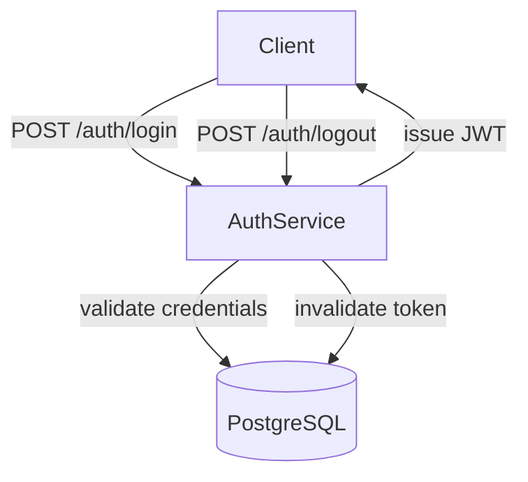

# Implementation Plan — User Authentication

## Approach
Build a standalone Express.js authentication service in TypeScript. The service exposes three
REST endpoints: login, logout, and a token refresh stub. PostgreSQL via Prisma handles user
storage and account lockout state.

## Key Design Decisions
- JWT stored in an httpOnly cookie per ADR-002 to reduce XSS risk
- Account lockout state stored in the database per ADR-003 to survive service restarts
- Prisma used for all DB access per ADR-001

## Architectural Diagram

## Data Models

### users table
| Column | Type | Notes |
|---|---|---|
| id | UUID | Primary key |
| email | VARCHAR | Unique, indexed |
| password_hash | VARCHAR | bcrypt hash |
| locked_until | TIMESTAMP | null if not locked |
| failed_attempts | INT | resets on success |

### audit_log table
| Column | Type | Notes |
|---|---|---|
| id | UUID | Primary key |
| user_id | UUID | FK to users |
| outcome | ENUM | success / failure |
| ip_address | VARCHAR | request origin |
| created_at | TIMESTAMP | auto |

## Phases
- Phase 1: Project setup — Express + TypeScript + Prisma schema
- Phase 2: POST /auth/login endpoint with credential validation and JWT issuance
- Phase 3: Account lockout logic
- Phase 4: POST /auth/logout with token invalidation
- Phase 5: Unit and integration tests

## Open Questions
- Token refresh endpoint — include in Phase 4 or defer to next iteration?
